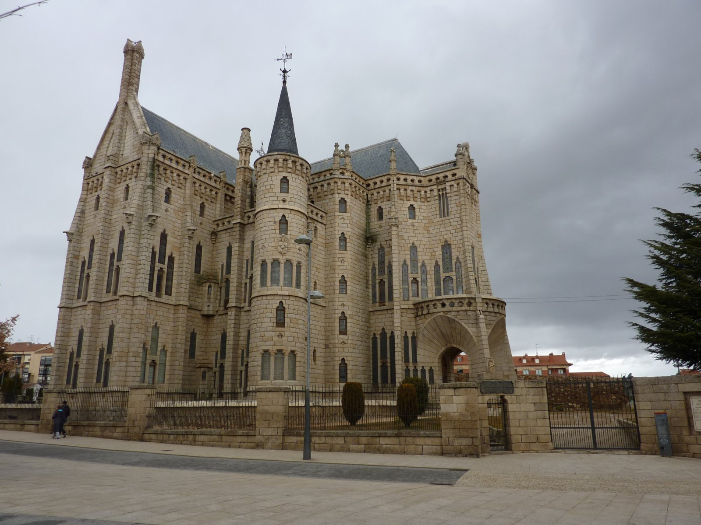
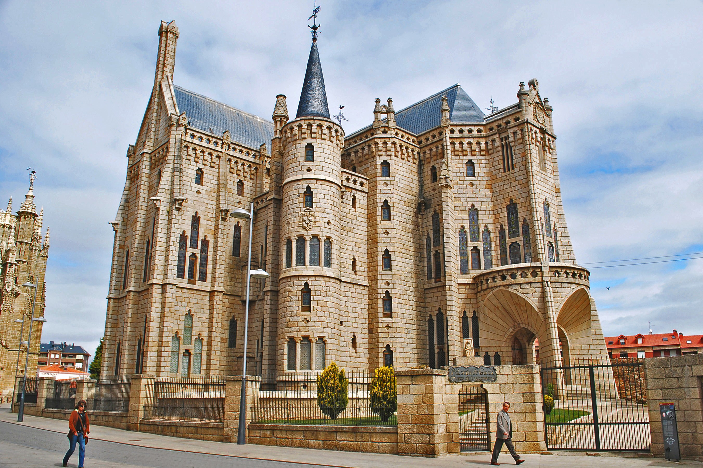
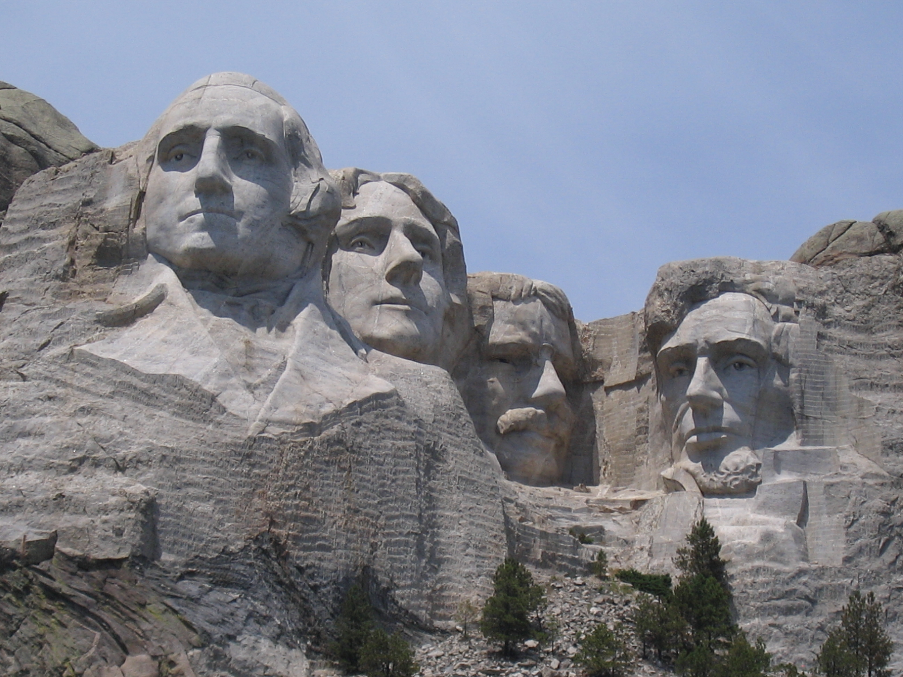
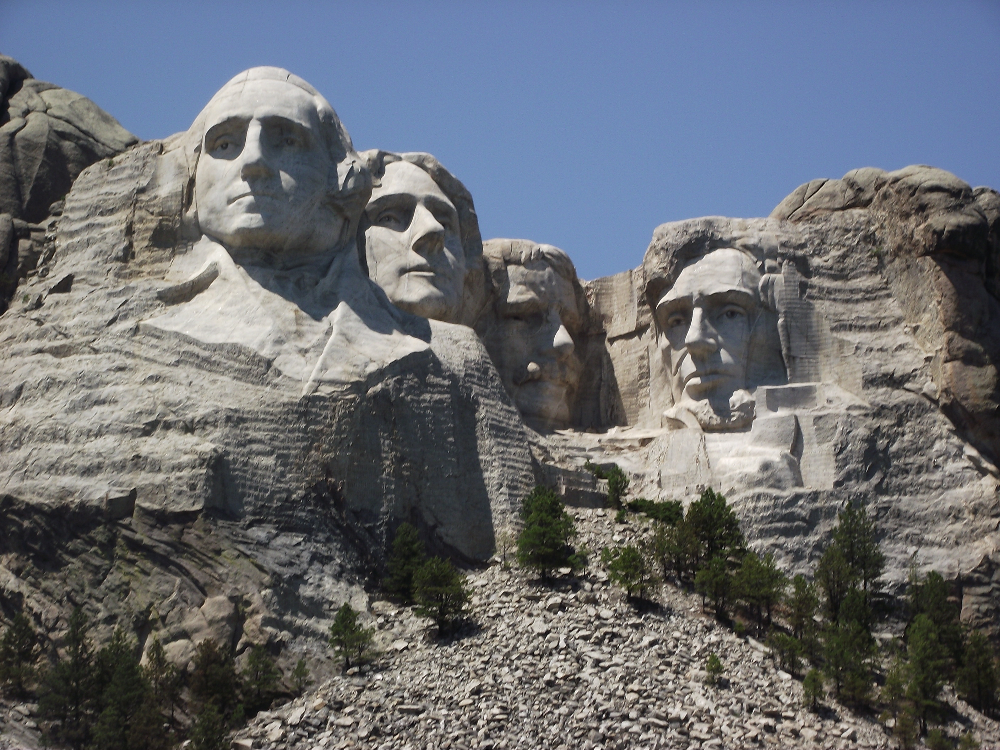
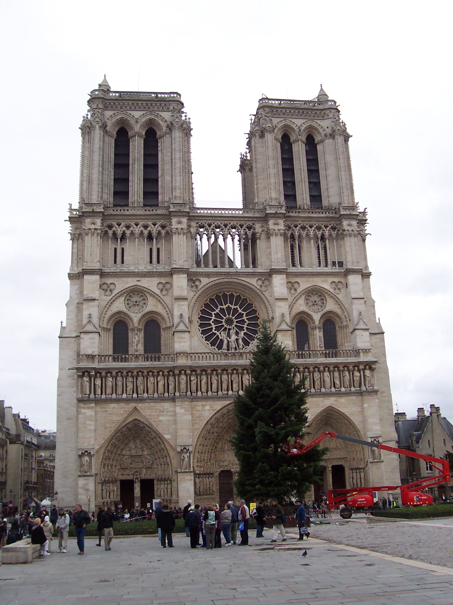
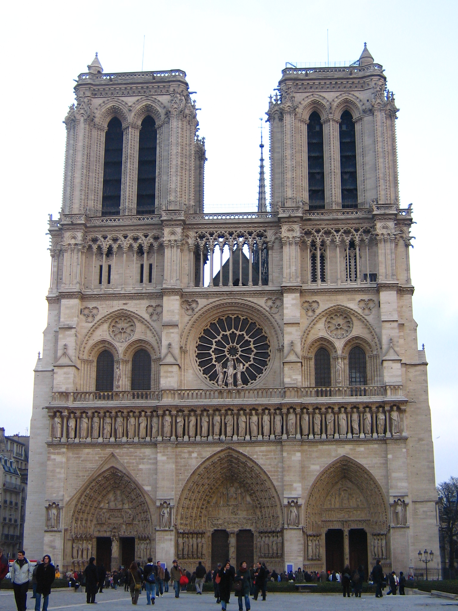

# Local-Feature-Match
UESTC-计算机视觉和模式识别

## Introduction

## Task

1. Loads and resizes images:  Matching with color information might be helpful,  and make images smaller to speed up the algorithm.
2. **Finds interest points in those images**
3. **Describes each interest point with a local feature**
4. **Finds matching features**
5. Visualizes the matches: Once you start detecting hundreds of interest points, the visualization can become crowded. You may also want to threshold based on confidence visualize.
6. Evaluates the matches based on ground truth correspondences:  This evaluation function will only work for the Notre Dame, Episcopal Gaudi, and Mount Rushmore image pairs.

## How to Start

* `helpers.py`: provides functions for preprocession, including giving the TA solutionm, evaluate how good we match images and visualize it.
* `memusecheck.py` : is used to check the amount of memory the running program uses.
* `proj2-averageAccuracy` : is used to calculate the average accuracy of our method in our test image data.
* `utils.py`: some APIs to load our data.
* `visualize.py`: some details about visualize images.
* `proj2.ipynb, proj2.html`: are notebooks to show the results of the whole project.
* `student.py` : the main part, and we will give the implement of 
  1. `get_interest_points`: a set of interest points for the input image
  2. `get_features`: a set of feature descriptors for a given set of interest points.
  3. `match_features`: the Nearest Neighbor Distance Ratio Test to assign matches between interest points in two images.

## Data

### Episcopal Gaudi

### Mount Rushmore

### Notre Dame

## Reference

[1]: D. G. Lowe, "Object recognition from local scale-invariant features," *Proceedings of the Seventh IEEE International Conference on Computer Vision*, Kerkyra, Greece, 1999, pp. 1150-1157 vol.2, doi: 10.1109/ICCV.1999.790410.

[2]: Herbert Bay, Andreas Ess, Tinne Tuytelaars, Luc Van Gool, Speeded-Up Robust Features (SURF), Computer Vision and Image Understanding, Volume 110, Issue 3, 2008, Pages 346-359, ISSN 1077-3142,

[3]: E. Rublee, V. Rabaud, K. Konolige and G. Bradski, "ORB: An efficient alternative to SIFT or SURF," *2011 International Conference on Computer Vision*, Barcelona, Spain, 2011, pp. 2564-2571, doi: 10.1109/ICCV.2011.6126544.

